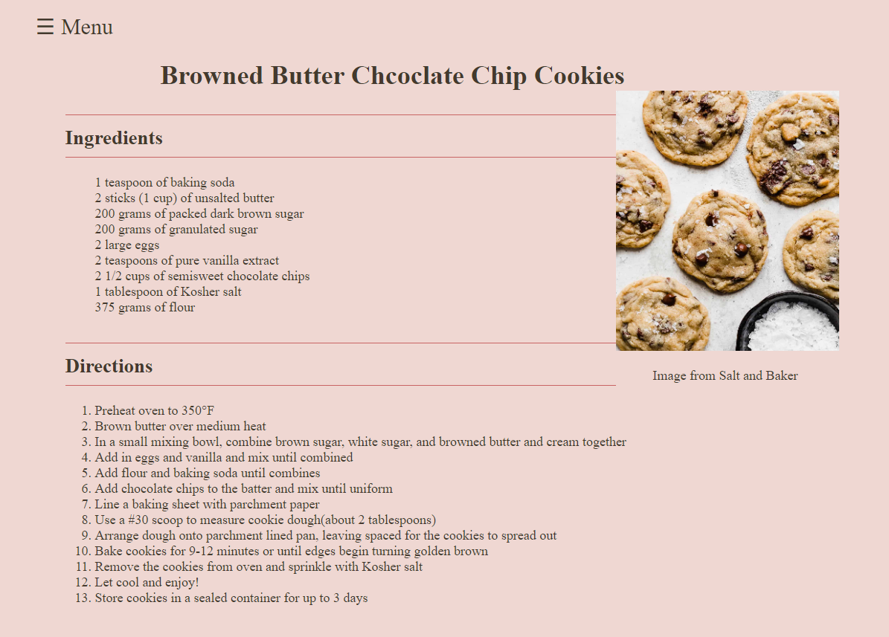
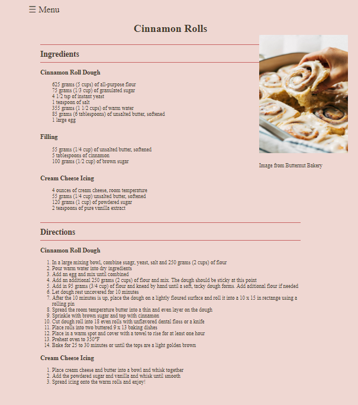
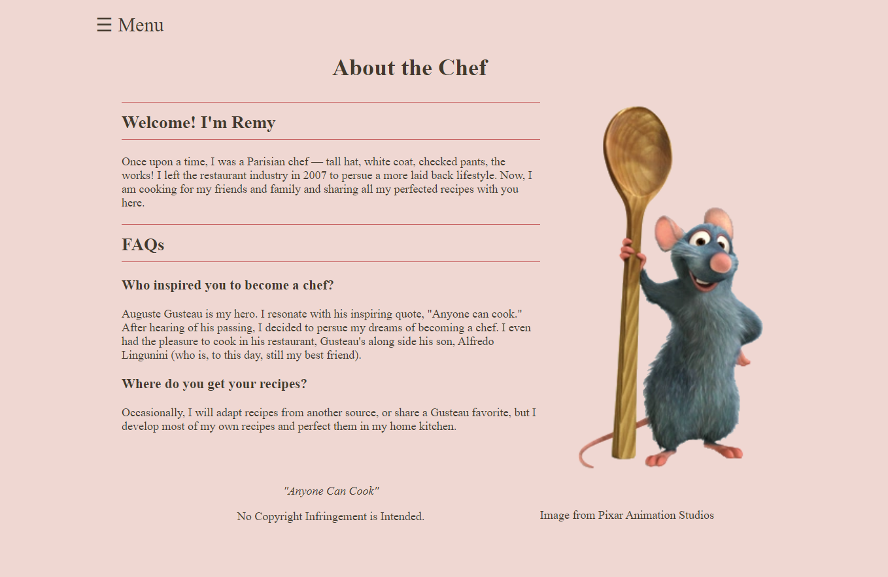

# Recipe Website Homepage 
>Olivia A.

#### Project Description:

I love to bake and I get most of my recipes from home bakery blogs so when challenged with the task of creating a homepage, I decided to create a mock recipe website page. 
I have included some of my favorite recipes that I am always asked for. This homepage is created with just HTML and CSS and can be run in a web browser after downloading the code 

>This is a screenshot of my browned butter chocolate chip cookie recipe. I included a picture of the chocolate chip cookies along with a list of ingredients the user will need and baking directions. 

>This is a screenshot of my cinnamon roll recipe. I included a picture of the cinnamon rolls along with a list of ingredients the user will need and baking directions.

>This is a screenshot of the "About the Chef" page. One of my favorite movies is Ratatouille, so I created a persona Remy as the chef and creater of these recipes. 

This was a mock application so I did not take the phots myself. I incuded imbedded links to the websites that the images came from. No Copyright Infringement is Intended. 
